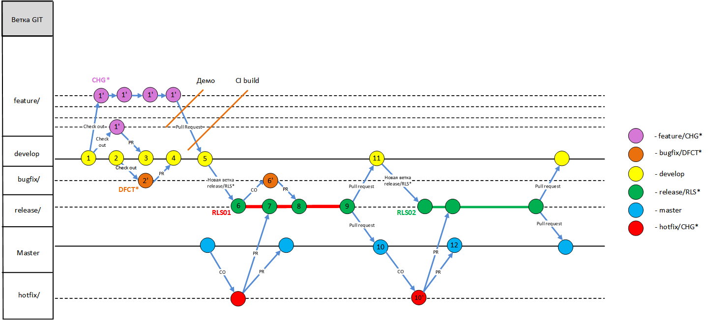

#gitFlow
  
_Примечание: стрелками изображена последовательность действий, а не наследование изменений_

##Описание ветвей, правила их названия и классификация
###Основные
`master` – код, который фактически находится на боевой среде.  
`develop` – интеграционная ветвь для завершенных feature-ветвей (задач), которые прошли приемку и которые включены в состав следующего релиза.  

###Вспомогательные
`feature/*` - ветви в которых фактически ведется разработка по задаче. Создается ответвлением от текущей версии `develop`. По завершению разработки вливается назад в develop. Объединение изменений нескольких разработчиков следует проводить до формирования PR.  
`enabler/*` - ветви, в которых ведется разработка по архитектурным задачам. Создается ответвлением от текущей версии `develop`. По завершению разработки вливается назад в develop.  
`hotfix/*` - ветвь в которой правится критический инцидент (проблема) найденная на боевой среде и иные задачи для внеплановой выкладки. Создается ответвлением от текущей версии master. По завершению разработки, вливается назад в `master` и текущую ветву `release/*` (при ее отсутствии - в `develop`).  
`bugfix/*` - создается от ветвей `develop` или `release/*` для правки найденного бага в соответствующей ветви бага. Завершается вливанием в ветвь-родитель.  
`release/*` – ветвь регрессионного тестирования и стабилизации, получается ответвлением из develop. По завершению регрессионного тестирования сливается с `master` и `develop`. 

##Работа с Pull Requests (PR)
**[Документация](https://docs.microsoft.com/en-us/azure/devops/repos/git/pull-requests?view=tfs-2017)**  
Основное назначение PR - ревью и обсуждение вносимых изменений. С точки зрения git - PR это попытка создания merge commit в удаленном репозитории. Иными словами - попытка включения сделанных вами изменений в общую историю проекта.  
PR, а также иные инструменты по работе с системой контроля версий можно найти на вкладке `Code` в TFS.  
В зависимости от ветви вливания - завершение PR может быть запрещено до удовлетворения определенного набора политик. Например минимальное количество утверждающих лиц, обязательные утверждающие лица, успешность сборки, разрешение всех комментариев, связи с рабочими элементами.  
Доступные варианты голосования: `Approved, Approved with suggestions, Wait for author, Reject`.  
Доступные варианты разрешения PR: `Complete, Set auto-complete, Abandon`.  

###Создание PR
1. Выполнить PUSH ветви с вашими изменениями из локального репозитория в ТФС.
1. На ТФС в проекте вашей команды перейти на вкладку Code->Pull Requests (Запросы на включение внесенных изменений)
1. Нажать "New Pull Request" (правый верхний угол)
1. Выбрать исходную (вашу) и целевую ветви. 
1. Заполнить форму по шаблону (в случае отсутвия - произвольно). В заголовке старайтесь указывать суть изменений, в описании - основные сделанные изменения.
1. Добавить связанные work item.
1. Нажать кнопку "Create"

##Полезные ссылки
**[Quickstarts](https://docs.microsoft.com/en-us/azure/devops/repos/git/share-your-code-in-git-vs-2017?view=tfs-2017)**  
**[Tutorials](https://docs.microsoft.com/en-us/azure/devops/repos/git/gitworkflow?view=tfs-2017)**  
**[Concepts](https://docs.microsoft.com/en-us/azure/devops/repos/git/history?view=tfs-2017)**  
**[How-to Guides](https://docs.microsoft.com/en-us/azure/devops/repos/git/git-tags?view=tfs-2017)**  