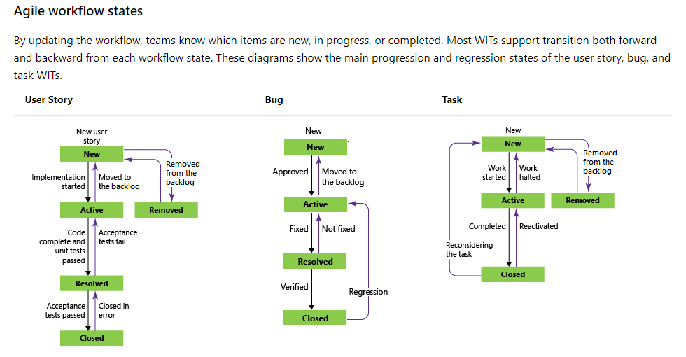

#Agile Workflow
##Информация
###Заметка о переводе
Перевод TFS с английского на русский делал какой-то папуас, поэтому обратный перевод:  
Ситуации - epic  
Функции - feature  
Истории - user story (story)  
Задача - task  
Ошибка - bug  

###Заметка о транзитивности определений
Feature в репозитории не всегда однозначно соответствует feature в agile.  
Что касается остальных определений в agile - они столь же agile, сколь и процесс, которые они описывают. В этом документе будут использоваться самые базовые. Полные можете найти в документации.

##Базовые понятия по agile
**[Документация по SAFE](https://www.scaledagileframework.com/)**  
**Sprint или iteration** - минимальная единица планирования в Agile. Фиксированный по длительности интервал в течении которого команды добавляют ценность в виде работающего и протестированного ПО и систем. Обычно продолжительность итерации 1-2 недели.  
**Program Increment** - интервал времени, состоящий из нескольких спринтов (итераций).  
**Epic** - мега-задача, которая потребует значительное количество коллективных и финансовых усилий в течении продолжительного периода времени (несколько PI).  
**Feature** - задача, которая выполнима за спринты одного PI, обладает ценностью для пользователя, к которой предъявляются критерии приемки. Зачастую разделяется между несколькими командами в поезде.  
**User story** - задача меньше объема, которая выполнима за итерацию (1-2 недели).  
**Task** - задача, определение которой ближе к конкретному действию.  
**Bug** - ошибка, которая возникла при работе над задачей.  

##TFS Work
**[Agile process документация](https://docs.microsoft.com/en-us/azure/devops/boards/work-items/guidance/agile-process?view=azure-devops)**  
Вкладка Work позволяет создавать и работать с work items. В упрощенном понимании work item - это задачи. Work item для разработки имееют несколько типов:  
`Epic, Feature, User story, task, bug`.  
Каждый из этих типов имеет собственный набор состояний и правил перехода между ними. В ваших проектах используется Agile workflow.  
  

Также TFS поддерживаает два вида представления задач: backlog (невыполненная работа) и board (канбан доска).  
Доска представляет более удобный инструмент при работе с задачами, в то время как в бэклоге можно нагляднее увидеть связи между ними.  

Также вкладка Work поддерживает запросы для удобной фильтрации задач. Запросы доступны при нажатии на Queries (создание запроса)

###Заполнение Work Item
**[Документация](https://docs.microsoft.com/en-us/azure/devops/boards/work-items/?toc=%2Fazure%2Fdevops%2Fboards%2Fwork-items%2Ftoc.json&bc=%2Fazure%2Fdevops%2Fboards%2Fwork-items%2Fbreadcrumb%2Ftoc.json&view=azure-devops)**  
Для добавления нового work item необходимо:  
1. Перейти на вкладку work вашего проекта.
1. Выбрать тип задачи для добавления, для чего перейти на соответствующую вкладку слева. Зависимые подзадачи можно добавлять непосредство к родительским из бэклога. User Story можно добавлять непосредственно в итерации.
1. Нажать New item (Создать).  

Заполнение work item:
1. Заполнить форму. Первоочередное внимание следует уделять полям название, описание, критерии принятия, классификация (бизнес или ), разработка.
1. В случае, задачи имеетс связанные задачи - следует добавить их через интерфейс "Связанная работа".
1. В разделе "Разработка" следует добавить ссылку ветку, в которой задача будет выполняться. Ветку можно создать прямо из формы, но это не привязывает созданную ветвь к задаче автоматически. Политики на основных ветвях в репозитории будут блокировать Pull-Request без связанных задач.   
1. User story из общего бэклога можно переносить в итерации, чтобы отделить текущую работу от общей.  
1. Не забыть сохранить. :)  
  

##Работа с итерациями
Как уже говорилось выше, итерация - минимальная единица планирования в Agile. Фиксированный по длительности интервал в течении которого команды добавляют ценность в виде работающего и протестированного ПО и систем. Обычно продолжительность итерации 1-2 недели.  
Не забывайте переносить work item'ы из статуса в статус при работе над ними.

Для начала работы с итерациями необходимо:
2. Перейти на вкладку Work.
2. Выбрать итерацию.
2. Задать срок итерации в правом верхнем углу.
2. Добавить юзер-стори для выполнения в этой итерации из уже существующих в backlog'е задач или создать новые.  